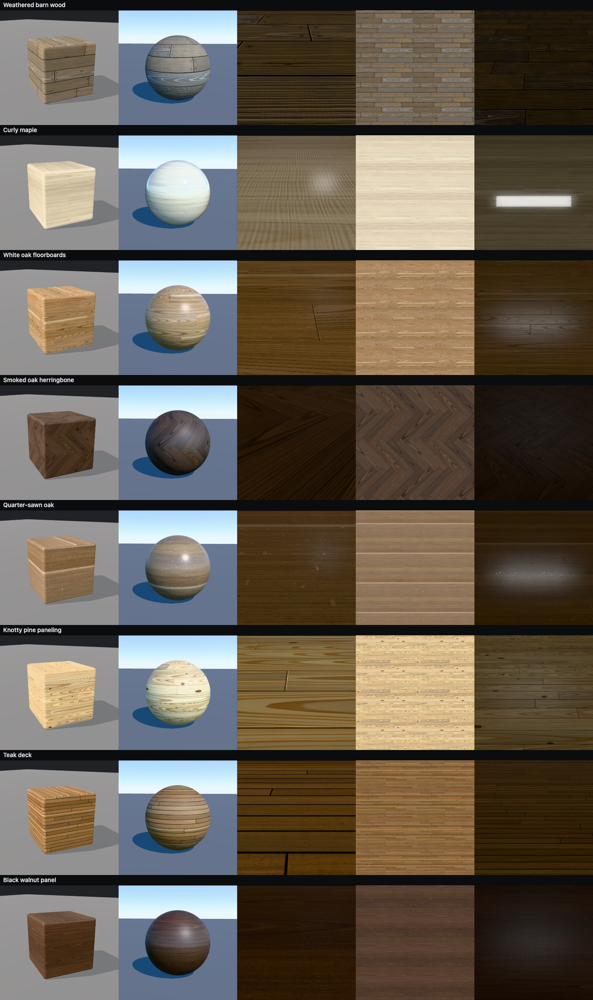
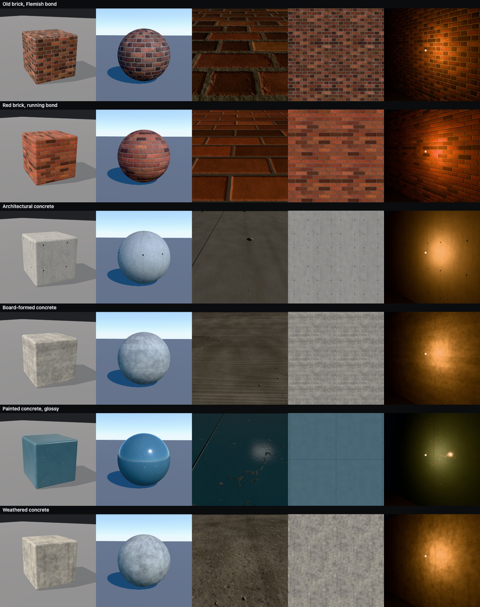
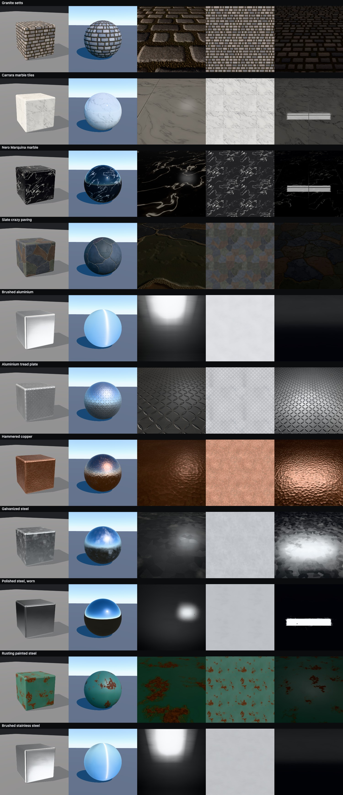

# materialab

Procedural PBR materials written as code (GLSL on the GPU), previewed from
nine viewpoints and lighting setups at once, and exported as game-ready
texture sets for **Godot 4** (`.tres`), **glTF 2.0** and anything else
that takes PNG maps.

Live demo here: [https://kumikumi.github.io/materialab/](https://kumikumi.github.io/materialab/)



```bash
npm install
npm run dev          # http://localhost:5173
```

Requires a browser with WebGL2 and float render targets (any current
Chrome, Edge, Firefox or Safari on desktop).

## The viewer

Every material is shown in nine views at the same time, so you never need
to move a camera to judge it:

| View | What it tells you |
| --- | --- |
| **Studio** | Rounded cube in a soft studio: edges, three face orientations, overall read. |
| **Sunlight** | Sphere under a 38° sun and sky: every normal direction, hard light, sky reflections. |
| **Tiling · flat light** | Orthographic 2×2 tiles under uniform light: color and pattern, repetition, seams (toggle tile borders). |
| **Close-up · raking light** | 30 cm from the surface, light 8° above it (swings slowly): relief, normal-map quality. |
| **Grazing · to the horizon** | Standing on a large floor looking at a low sun: distance/mip behavior, grazing-angle gloss, visible repetition. |
| **Softbox reflections** | Flat panel mirroring strip lights (tilts slowly): glossiness and roughness variation. |
| **Lamp at night** | Wall lit by a warm point light 35 cm away: local specular, falloff, glints. |
| **Macro** | 10 cm straight-on patch: is the texel density high enough? |
| **Maps** | Albedo, normal, roughness, metallic, AO and height as raw textures. |

All views use real-world scale: geometry UVs are in meters, and each
material declares the physical size of its tile.

- Drag a view to orbit, scroll to zoom, **double-click** to focus it full size (again or `Esc` to return).
- `←`/`→` switch material · `R` random seed · `A` animated lights · `D` displacement (dense meshes, preview only) · `B` tile borders · `E` export.
- Parameters in the right panel re-bake instantly (full resolution on
  fast GPUs, otherwise a quick 512 px preview while dragging). Tweaks are
  remembered per material in the browser; the ↺ button resets a value,
  **Copy params** puts the current values on the clipboard as a preset.
- Editing a generator or GLSL library hot-reloads the current material
  without resetting the cameras. Shader compile errors are shown with the
  file, line and offending code.

## Materials included

| Wood | Masonry & concrete | Stone | Metal |
| --- | --- | --- | --- |
| White oak floorboards | Red brick, running bond | Granite setts | Brushed aluminium |
| Quarter-sawn oak (ray fleck) | Old brick, Flemish bond | Carrara marble tiles | Brushed stainless steel |
| Smoked oak herringbone | Architectural concrete (tie holes) | Nero Marquina marble | Polished steel, worn |
| Black walnut panel | Board-formed concrete | Slate crazy paving | Hammered copper |
| Knotty pine paneling | Weathered concrete | Slate roof (+ mossy) | Galvanized steel |
| Curly maple (clear coat) | Painted concrete, glossy | Limestone trim | Aluminium tread plate |
| Teak deck | House brick: clean, grimy, mossy (a blend set) | | Rusting painted steel |
| Weathered barn wood | | | |




### How the wood works

The wood generator doesn't paint grain on. It models it (`src/glsl/wood.glsl`).
Every board is a slice through a virtual log: the pith sits below the board
for flat-sawn boards and beside it for quarter-sawn ones, and it drifts along
the board. Each surface point is mapped into the log's cross-section and the
anatomy is evaluated there in 3D:

- **annual rings** with independent year-to-year widths, earlywood → latewood
  transitions (gradual for maple and walnut, abrupt for pine and oak) and
  wavy, lobed rings;
- **vessels (pores)** running along the grain: ring-porous (oak, ash) or
  diffuse-porous (walnut, maple, teak). They are cut obliquely by the face,
  so they show up as dashed pore lines;
- **rays**: thin radial ribbons that appear as short dark dashes on
  flat-sawn faces and as broad light flecks on quarter-sawn faces;
- **knots**: live and dead (dark rim, radial checks), with the surrounding
  grain flowing around them;
- **figure**: curl (tiger stripes) done as relief, so the stripes flip
  light and dark with the light direction;
- heartwood and sapwood, mineral streaks, weathering (silvering, eroded
  earlywood, checks, nail holes, saw marks), wear and finishes.

Cathedral arches, straight quarter-sawn grain and ray fleck aren't painted.
They come out of the geometry.

### Blend sets

Games often blend several versions of one surface by vertex colour or a mask:
clean, grimy and mossy brick, for example. The versions must share their
layout, or the joints swim where they blend. A blend set is therefore one base
preset plus variants that spread its parameters and change only colour and
weathering (`brick-house-grimy.ts` is `{ ...base, params: { ...base.params,
soot: 0.9, … } }`). Same seed, same bricks.

The brick generator's weathering includes **moss**. It fills the joints,
chips and pits first, then spreads over the faces in patches, and it raises
the height a little, so a height-based blend can bring the cushions through
first. **Wedge** makes each unit thicker at its lower edge, which turns the
brick generator into overlapping roof slates (`roof-slate`). polylab's
vertex-blended materials use these sets directly (see its `house.ts`).

## Exporting

**Export material** (or `E`) bakes at export resolution and writes into
`exports/<material-id>/` through the dev server. Set
`MATERIALAB_EXPORT_DIR=/path/to/godot-project/materials npm run dev` to write
straight into a game project. In a static build (`npm run build`) the same
button downloads a `.zip`.

Batch export from the command line (opens the app in your default browser,
since the generators run on the GPU, then exits when done):

```bash
npm run export                                  # everything at 2048 px
npm run export -- oak-floorboards brick-red --res 4096 --ss 3
npm run export -- --out ../my-game/materials --dx --unity
```

| File | Content |
| --- | --- |
| `<id>_albedo.png` | Base color, sRGB, 8-bit RGB |
| `<id>_normal.png` | Tangent-space normal, **OpenGL (+Y)** convention (Godot, Blender, Unity, glTF). `--dx` / checkbox adds `_normal_dx.png` for Unreal. 16-bit optional. |
| `<id>_roughness.png`, `_metallic.png`, `_ao.png` | 8-bit grayscale |
| `<id>_orm.png` | Packed R = AO, G = roughness, B = metallic (glTF, Godot `ORMMaterial3D`, Unreal) |
| `<id>_height.png` | **16-bit** height, black = lowest, white = highest; the range is in the JSON |
| `<id>_unity_mask.png` | optional: R = metallic, G = AO, A = smoothness (HDRP mask map / URP metallic map) |
| `<id>.tres` | Godot 4 `StandardMaterial3D` using the separate maps |
| `<id>_orm.tres` | Godot 4 `ORMMaterial3D` using the packed map |
| `<id>.gltf` | glTF 2.0: the material on a one-tile quad (with `KHR_materials_anisotropy` / `KHR_materials_clearcoat` where used) |
| `<id>.json` | Manifest: tile size in meters, height range, parameters, seed, conventions |

All maps tile seamlessly. Height-derived normals and AO are computed with
wrap-around, so they have no seams either.

### Using the materials in Godot 4

1. Copy (or export directly) the material folder anywhere under your project
   and drop `<id>.tres` onto a mesh. Godot detects the normal map on import.
2. **Scale.** One UV unit is one tile, whose size in meters is listed in the
   JSON (e.g. 0.9 m for the red brick). For correct real-world size on
   arbitrary meshes, enable `uv1_triplanar` + `uv1_world_triplanar` and set
   `uv1_scale` to `1 / tile size`. On UV-mapped meshes, set `uv1_scale`
   so that UV density matches.
3. **Parallax.** Masonry, cobbles, tread plate and similar have
   `heightmap_enabled = true` with a physically derived `heightmap_scale`
   (`100 × height range / tile size`). Turn it off on distant or
   performance-critical surfaces.
4. Brushed metals use `anisotropy` along the texture's u axis (the value is
   negative because the highlight stretches across the brushing), so orient
   the UVs along the brush direction.

## Writing a material

A material is a **generator** (GLSL + parameter schema) plus a **preset**
(values for its parameters). Many materials can share one generator. For
example, all eight woods are presets of `src/generators/wood.ts`.

A new preset is a file in `src/materials/**`. It is picked up automatically:

```ts
import { defineMaterial } from '../../engine/types';
import { woodGenerator } from '../../generators/wood';

export default defineMaterial({
  id: 'cherry-panel',
  name: 'Cherry panel',
  category: 'Wood',
  generator: woodGenerator,
  seed: 3,
  params: { earlyColor: '#b8744b', lateColor: '#9a5a36', poreType: 2, roughness: 0.35 },
});
```

A new generator defines its parameters and one GLSL function:

```ts
export const myGenerator = defineGenerator({
  id: 'tiles',
  params: {
    tiles: { type: 'int', group: 'Layout', default: 4, min: 1, max: 16 },
    color: { type: 'color', group: 'Color', default: '#c8c2b8' },
    grout: { type: 'float', group: 'Layout', default: 3, min: 0, max: 10, step: 0.1, unit: 'mm' },
  },
  tileSize: (p) => [0.6, 0.6],          // meters covered by one texture tile
  extras: (p) => ({ parallax: true }),  // clearcoat, anisotropy, parallax
  glsl: /* glsl */ `
    void surface(vec2 uv, inout Surface s) {
      Cell c = gridLayout(uv, tiles, tiles, 0.0, 1.0);
      float joint = 1.0 - smoothstep(0.0, grout * 0.0005, c.edge);
      s.albedo = mix(varyColor(color, vec3(0.01, 0.1, 0.08), c.rnd.xyz), vec3(0.5), joint);
      s.height = -1.5 * joint + 0.1 * pfbm(uv, F(0.01), 4, 0.5, 1.0);   // millimeters
      s.roughness = mix(0.35, 0.9, joint);
    }`,
});
```

Conventions inside `surface()`:

- `uv` is tile space `[0, 1)`. Anything built from the periodic functions
  below tiles seamlessly; `u_tileSize` is the tile size in meters.
- `s.albedo` is **sRGB** (like picking colors in an image editor),
  `s.height` is in **millimeters** (normals and AO come from it
  automatically at physically correct strength), `s.roughness` is
  perceptual roughness, `s.ao` is extra material cavity multiplied into the
  height-based AO.
- Parameters are uniforms with the parameter's name. Types are `float`,
  `int`, `bool`, `color` (`vec3` sRGB) and `enum` (`int`).
- Each texel is supersampled (`n×n`), so thin features stay antialiased.

GLSL library (`src/glsl/`, always included):

| | |
| --- | --- |
| `noise.glsl` | `pnoise`, `pfbm`, `pridged`, `pvalue`, `pvoronoi` (F1, F2, edge distance, cell id), `pworley`, `pspeckle`: periodic, take `(uv, freq)` with integer cells per tile; `F(size_m)` converts a feature size to a frequency. Non-periodic `noise3`, `fbm3`, `noise1`, `fbm1` for volumetric work. `hash4`/`hash1`. |
| `layout.glsl` | `plankLayout`, `gridLayout` (running/stack bond), `flemishLayout`, `herringboneLayout` → `Cell` with local coordinates in meters, size, edge distance, stable per-cell random numbers. |
| `surface.glsl` | `pscratches`, `pcracks` (branching crack networks), `pdirt`, `pstreaks`. |
| `wood.glsl` | The wood model: `makeLog`, `woodSample`, `woodColor`. |
| `concrete.glsl` | `concreteSurface`: cast concrete with mottling, sand, aggregate, bugholes. |
| `util.glsl` | color helpers (`varyColor`, `ramp3`, `srgbToLinear`), `sat`, `linstep`, `remap`, SDFs, `rot2`. |

## Project layout

```
src/
  engine/     types, shader assembly, GPU baker (generate -> normal / AO / pack)
  glsl/       shared GLSL libraries
  generators/ one file per generator (GLSL + parameters)
  materials/  presets, grouped by category; picked up automatically
  viewer/     multi-view renderer, procedural environments, metric-UV geometry
  export/     PNG/ZIP writers (worker pool), Godot / glTF / JSON writers
  ui/         side panel
scripts/export.ts   batch export CLI
vite.config.ts      dev-server endpoints that write exports to disk
```

## Development helpers

The page exposes `window.materialab` in the devtools console:

- `seamReport()` bakes every material and prints how large the jump across
  the tile border is compared to neighbouring texels (≈ 1 means seamless).
- `gallery(name, ids, views)` writes a contact sheet to `shots/<name>.jpg`.
- `shotView(name, viewId)` / `dumpMaps(name, [x, y, w, h])` save a single
  view or raw map crops to `shots/`.

URL parameters: `#<material-id>`, `?anim=0` (static lights), `?res=` /
`?ss=` (preview bake), `?view=<id>` (start focused), `?shot=all` (save a
screenshot of every material to `shots/`), `?export=all|id,id` (what the
CLI uses).

## Notes and limitations

- The preview uses three.js `MeshPhysicalMaterial` with Khronos Neutral tone
  mapping by default (AgX and ACES are in the View panel). It is close to,
  but not identical to, Godot's renderer.
- Height is shown as parallax in Godot but not in the preview. The
  **Displacement** toggle shows true geometric relief on dense meshes.
- Anisotropy is exported for brushing along the u axis only; there are no
  flow maps yet.
- The glTF export has been checked by importing it into Blender. The Godot
  `.tres` files follow Godot 4's text resource format but have not been
  opened in Godot as part of development.
